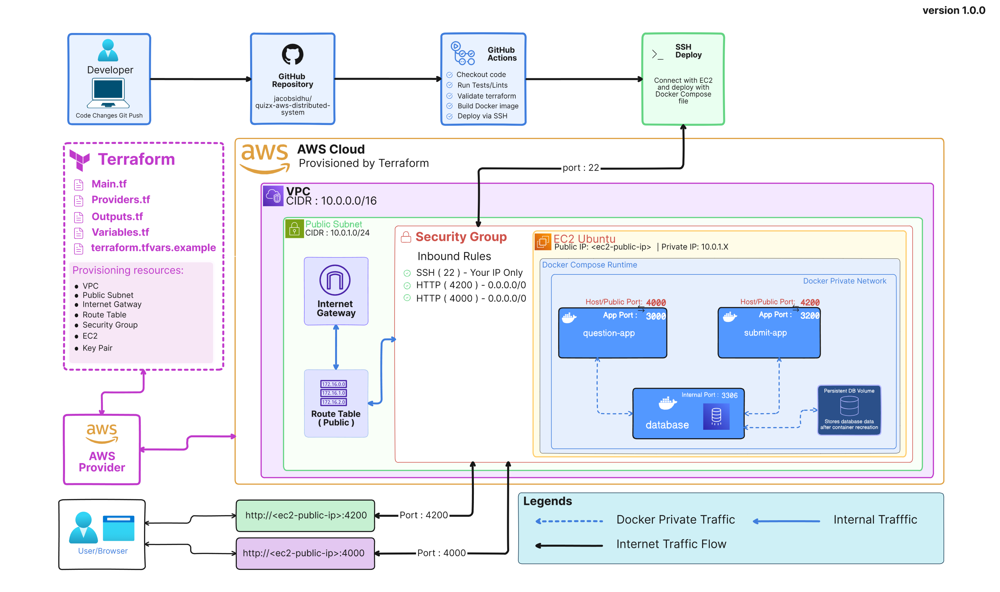

# QuizX AWS Distributed System

**Version:** `v1.0.0-option1-terraform-cicd-ec2-docker`  
**Status:** Foundation release  
**Cloud Provider:** AWS  
**Deployment Model:** Single EC2 instance, Docker Compose, Terraform, GitHub Actions  
**Question App Prototype:** [Question App v1.0.0 Figma prototype](https://www.figma.com/proto/KCH2RPRIBkATIy3ZgRKi79/QuizX?node-id=41-113&t=FFJBauryCt84Bxe9-1)  
**Submit App Prototype:** [Submit App v1.0.0 Figma prototype](https://www.figma.com/proto/KCH2RPRIBkATIy3ZgRKi79/QuizX?node-id=0-1&t=1fftyZSMal3CHOug-1)

---

## Project Overview

QuizX is a cloud-hosted multiple-choice question system deployed on AWS.

This first release demonstrates how to provision AWS infrastructure using Terraform, deploy a multi-container Node.js application on EC2 using Docker Compose, and automate application deployment using GitHub Actions.

The system contains two independent Node.js Express applications:

1. **Question App** — allows users to retrieve random quiz questions by category.
2. **Submit App** — allows users to submit new questions, answers, and categories.

Both applications communicate with a private database container over a Docker network. The database is not publicly exposed, and persistent storage is provided through a Docker volume.

This version is intentionally designed as a foundation release. It focuses on EC2, Docker, Terraform, GitHub Actions, Linux server setup, security group configuration, and professional documentation.

---

## Architecture



---

## Architecture Flow

```text
Developer
   |
   | git push / workflow dispatch
   v
GitHub Repository
   |
   | GitHub Actions
   | - run CI checks
   | - validate Terraform
   | - run Terraform apply/destroy workflow
   | - deploy app containers to EC2 over SSH
   v
AWS EC2 Instance
   |
   | Docker Compose
   |
   |-- question-app container
   |     container port: 3000
   |     host port: 4000
   |
   |-- submit-app container
   |     container port: 3200
   |     host port: 4200
   |
   |-- mysql container
   |     internal port: 3306
   |     no public exposure
   |
   |-- private Docker network
   |-- persistent Docker database volume
```

---

## What This Project Deploys

This project deploys:

| Component | Description |
|---|---|
| AWS VPC | Network boundary for the project infrastructure |
| Public subnet | Subnet used for the EC2 instance |
| Internet gateway | Allows internet access to public resources |
| Route table | Routes public traffic through the internet gateway |
| Security group | Controls inbound and outbound access |
| EC2 instance | Ubuntu server used to run Docker containers |
| Docker runtime | Installed on EC2 before running Docker Compose |
| Question app container | Node.js Express app for reading quiz questions |
| Submit app container | Node.js Express app for submitting quiz questions |
| Database container | MySQL container for persistent quiz data |
| Docker network | Private internal communication between containers |
| Docker volume | Persistent database storage |
| GitHub Actions CI | Validates application and infrastructure code |
| GitHub Actions CD | Provisions infrastructure and deploys application containers to EC2 |

---

## Technology Stack

| Area | Technology |
|---|---|
| Cloud provider | AWS |
| Infrastructure as Code | Terraform |
| Compute | Amazon EC2 |
| Operating system | Ubuntu Linux |
| Runtime | Docker |
| Orchestration | Docker Compose |
| Backend | Node.js, Express.js |
| Database | MySQL |
| CI/CD | GitHub Actions |
| Remote deployment | SSH |
| Documentation | Markdown |
| Version control | Git and GitHub |

---

## Repository Structure

```text
quizx-aws-distributed-system/
├── app/
│   ├── question-app/
│   │   ├── public/
│   │   ├── src/
│   │   ├── Dockerfile
│   │   ├── package.json
│   │   └── README.md
│   │
│   └── submit-app/
│       ├── public/
│       ├── src/
│       ├── Dockerfile
│       ├── package.json
│       └── README.md
│
├── infra/
│   ├── terraform/
│   │   ├── providers.tf
│   │   ├── main.tf
│   │   ├── variables.tf
│   │   ├── outputs.tf
│   │   └── terraform.tfvars.example
│   │
│   └── docker/
│       └── docker-compose.yml
│
├── database/
│   ├── mysql/
│   │   ├── schema.sql
│   │   └── seed.sql
│   └── exports/
│
├── docs/
│   ├── architecture/
│   │   ├── quizx-aws-v1-architecture.png
│   │   └── architecture-explanation.md
│   ├── screenshots/
│   ├── testing/
│   │   └── v1-test-evidence.md
│   ├── security-notes.md
│   ├── cost-notes.md
│   └── learning-log.md
│
├── .github/
│   └── workflows/
│       ├── cli.yml
│       └── deploy.yml
│
├── .env.example
├── .gitignore
├── README.md
└── RELEASE_NOTES.md
```

---

## Application Components

### Question App

The Question App provides a UI and API for retrieving questions.

Required endpoints:

| Method | Endpoint | Purpose |
|---|---|---|
| `GET` | `/categories` | Returns all available categories |
| `GET` | `/questions/:category` | Returns one random question from a category |
| `GET` | `/questions/:category?count=n` | Returns up to `n` questions from a category |

Expected behaviour:

- Categories are loaded from the database.
- Questions are filtered by category.
- Answer options are returned for each question.
- Users can select an answer in the UI.
- Static frontend files are served by the Express server.

---

### Submit App

The Submit App provides a UI and API for submitting new quiz questions.

Required endpoints:

| Method | Endpoint | Purpose |
|---|---|---|
| `POST` | `/submit` | Adds a new question, category, and answers |
| `GET` | `/categories` | Returns categories for the dropdown list |
| `GET` | `/docs` | Returns API documentation |

Expected behaviour:

- Users can submit a new question.
- Users can submit four answers.
- One answer must be marked as correct.
- Users can select an existing category.
- Users can create a new category.
- Empty or incomplete submissions are rejected.
- Duplicate categories are prevented.
- API documentation is available through `/docs`.

---

## Port Mapping

| Component | Container Port | Host/Public Port | Publicly Exposed |
|---|---:|---:|---|
| Question app | `3000` | `4000` | Yes |
| Submit app | `3200` | `4200` | Yes |
| Database | `3306` or `27017` | Not mapped | No |

The database must only be reachable from the application containers through the private Docker network.

---

## Design Decisions

### Why EC2?

EC2 was chosen for this version because it provides direct exposure to Linux server administration, SSH access, Docker installation, firewall/security group configuration, and application deployment fundamentals.

### Why Docker Compose?

Docker Compose allows the project to run multiple application containers and a database container using one configuration file. It also provides service-name based networking, which allows containers to communicate using names such as `mysql` instead of hardcoded IP addresses.

### Why Terraform?

Terraform makes the infrastructure repeatable, version-controlled, and easier to rebuild. Instead of manually creating EC2, networking, and security group resources, the infrastructure is defined as code.

### Why GitHub Actions?

GitHub Actions is used to automate validation and deployment. The CI workflow checks that the project can build correctly, while the deployment workflow connects to EC2 and updates the running Docker Compose application.

### Why not expose the database publicly?

The database is an internal dependency. Exposing it to the public internet would increase the attack surface and is unnecessary for this version. Only the application ports are publicly accessible.

---

## Security Notes

Security decisions for this version:

- SSH access is restricted to the developer's IP address.
- Only ports `4000` and `4200` are publicly exposed for application access.
- Database ports are not publicly exposed.
- Application containers communicate with the database using a private Docker network.
- Real `.env` files are not committed.
- Real `terraform.tfvars` files are not committed.
- Terraform state files are not committed.
- AWS credentials are not committed.
- Private SSH keys are not committed.
- GitHub repository secrets are used for deployment credentials.

See:

```text
docs/security-notes.md
```

---

## Prerequisites

Before using this project, you need:

- AWS account
- AWS CLI configured locally or in Codespaces
- Terraform installed
- Git installed
- Docker installed for local testing
- Docker Compose plugin installed
- GitHub repository
- SSH key pair for EC2 access
- GitHub Actions secrets configured

---

## Environment Variables

Create a real `.env` file from the example file:

```bash
cp .env.example .env
```

Example variables:

```env
DB_TYPE=mysql
DB_HOST=mysql
DB_PORT=3306
DB_NAME=quizx
DB_USER=quizx_user
DB_PASSWORD=replace_with_secure_password

QUESTION_APP_PORT=3000
SUBMIT_APP_PORT=3200
```

Do not commit the real `.env` file.

---

## Local Deployment Steps

From the project root:

```bash
docker compose -f infra/docker/docker-compose.yml up -d --build
```

Check running containers:

```bash
docker ps
```

View logs:

```bash
docker logs quizx-question-app
docker logs quizx-submit-app
docker logs quizx-mysql
```

Test locally:

```bash
curl http://localhost:4000/categories
curl http://localhost:4000/questions/Science
curl "http://localhost:4000/questions/Science?count=3"
curl http://localhost:4200/categories
curl http://localhost:4200/docs
```

Stop local containers:

```bash
docker compose -f infra/docker/docker-compose.yml down
```

---

## Terraform Deployment Steps

Go to the Terraform directory:

```bash
cd infra/terraform
```

Initialise Terraform:

```bash
terraform init
```

Format Terraform files:

```bash
terraform fmt
```

Validate Terraform configuration:

```bash
terraform validate
```

Create a local `terraform.tfvars` file from the example:

```bash
cp terraform.tfvars.example terraform.tfvars
```

Update the values in `terraform.tfvars`, including:

```hcl
aws_region          = "eu-west-2"
project_name        = "quizx-aws"
allowed_ssh_cidr    = "YOUR_PUBLIC_IP/32"
ssh_public_key_path = "~/.ssh/id_rsa.pub"
instance_type       = "t2.micro"
```

Review the plan:

```bash
terraform plan
```

Apply the infrastructure:

```bash
terraform apply
```

View outputs:

```bash
terraform output
```

Expected outputs include:

```text
ec2_public_ip
question_app_url
submit_app_url
ssh_command
```

---

## GitHub Actions CI/CD

This project uses two workflows:

```text
.github/workflows/cli.yml
.github/workflows/deploy.yml
```

### CI Workflow

The CI workflow should run on push and pull request.

It validates:

- Question app dependency installation
- Submit app dependency installation
- Docker image builds
- Terraform formatting
- Terraform validation

### Deploy Workflow

The deploy workflow runs Terraform apply or destroy from GitHub Actions.

On apply, it also:

1. Reads the EC2 public IP from Terraform outputs.
2. Connects to EC2 using the `EC2_SSH_PRIVATE_KEY` secret.
3. Waits for cloud-init and Docker readiness.
4. Copies the checked-out repository files to EC2.
5. Runs Docker Compose on EC2.
6. Rebuilds and restarts containers.
7. Prints the public Question App and Submit App URLs.

---

## Required GitHub Secrets

Configure these in:

```text
GitHub Repository → Settings → Secrets and variables → Actions
```

| Secret | Purpose |
|---|---|
| `AWS_ACCESS_KEY_ID` | AWS access key |
| `AWS_SECRET_ACCESS_KEY` | AWS secret access key |
| `AWS_REGION` | AWS region, for example `eu-west-2` |
| `ALLOWED_SSH_CIDR` | CIDR allowed to SSH into EC2 |
| `QUESTION_APP_CIDR` | CIDR allowed to access port `4000` |
| `SUBMIT_APP_CIDR` | CIDR allowed to access port `4200` |
| `AWS_AMI_ID` | Ubuntu AMI used for EC2 |
| `SSH_PUBLIC_KEY` | Public key registered as the EC2 key pair |
| `EC2_SSH_PRIVATE_KEY` | Private key matching `SSH_PUBLIC_KEY` for SSH deployment |

For a later production-style version, GitHub OIDC with an IAM role should replace long-lived AWS access keys.

---

## AWS EC2 Deployment Steps

After Terraform creates the EC2 instance, SSH into the server:

```bash
ssh -i <private-key-path> ubuntu@<EC2_PUBLIC_IP>
```

Confirm Docker is installed:

```bash
docker --version
docker compose version
```

Clone the repository if needed:

```bash
git clone https://github.com/<your-username>/quizx-aws-distributed-system.git
cd quizx-aws-distributed-system
```

Create the `.env` file on EC2:

```bash
nano .env
```

Start the application:

```bash
docker compose -f infra/docker/docker-compose.yml up -d --build
```

Check containers:

```bash
docker ps
```

Test from the EC2 server:

```bash
curl http://localhost:4000/categories
curl http://localhost:4200/categories
```

Test from your local browser:

```text
http://<EC2_PUBLIC_IP>:4000
http://<EC2_PUBLIC_IP>:4200
```

---

## Testing

### API Tests

```bash
curl http://<EC2_PUBLIC_IP>:4000/categories
curl http://<EC2_PUBLIC_IP>:4000/questions/AWS
curl "http://<EC2_PUBLIC_IP>:4000/questions/AWS?count=3"
curl http://<EC2_PUBLIC_IP>:4200/categories
curl http://<EC2_PUBLIC_IP>:4200/docs
```

### Submit Test

```bash
curl -X POST http://<EC2_PUBLIC_IP>:4200/submit \
  -H "Content-Type: application/json" \
  -d '{
    "category": "AWS",
    "question": "Which AWS service provides virtual servers?",
    "answers": [
      { "text": "EC2", "isCorrect": true },
      { "text": "S3", "isCorrect": false },
      { "text": "RDS", "isCorrect": false },
      { "text": "CloudFront", "isCorrect": false }
    ]
  }'
```

Confirm the submitted question is available:

```bash
curl http://<EC2_PUBLIC_IP>:4000/questions/AWS
```

---

## Persistence Test

The database must keep data after containers are restarted or recreated.

Add a new question, then run:

```bash
docker compose -f infra/docker/docker-compose.yml down
docker compose -f infra/docker/docker-compose.yml up -d
```

Then confirm the question still exists:

```bash
curl http://localhost:4000/questions/AWS
```

Do not delete the Docker volume during this test.

---

## Basic Resilience Test

Stop the question app:

```bash
docker stop quizx-question-app
```

Confirm the submit app is still reachable:

```bash
curl http://localhost:4200/categories
```

Restart the question app:

```bash
docker start quizx-question-app
```

Stop the submit app:

```bash
docker stop quizx-submit-app
```

Confirm the question app is still reachable:

```bash
curl http://localhost:4000/categories
```

Restart the submit app:

```bash
docker start quizx-submit-app
```

Document the result honestly in:

```text
docs/testing/v1-test-evidence.md
```

---

## Screenshots

Screenshots should be stored in:

```text
docs/screenshots/
```

Recommended screenshots:

| Screenshot | Purpose |
|---|---|
| EC2 instance running | Shows AWS compute resource |
| Security group inbound rules | Shows controlled public access |
| Terraform apply output | Shows infrastructure deployment |
| Terraform outputs | Shows generated URLs/IPs |
| GitHub Actions CI success | Shows automated validation |
| GitHub Actions deploy success | Shows automated deployment |
| Docker containers running | Shows deployed runtime |
| Question app UI | Shows user-facing question app |
| Submit app UI | Shows user-facing submit app |
| `/categories` API response | Shows category retrieval |
| `/questions/:category` response | Shows question retrieval |
| `/docs` endpoint | Shows API documentation |
| Persistence test | Shows database volume behaviour |
| Resilience test | Shows independent container operation |

---

## Cleanup

To stop containers on EC2:

```bash
docker compose -f infra/docker/docker-compose.yml down
```

To remove containers and unused images:

```bash
docker system prune -f
```

To destroy AWS infrastructure:

```bash
cd infra/terraform
terraform destroy
```

Confirm resources are removed from AWS:

- EC2 instance
- Security group
- Route table
- Internet gateway
- Public subnet
- VPC
- Any unused EBS volumes
- Any unused Elastic IPs, if created manually

---

## Cost Management

This version is designed to keep cost low.

Cost considerations:

- EC2 may generate cost while running.
- EBS storage may still generate cost if the instance is stopped.
- Unattached Elastic IPs may generate cost.
- NAT Gateway is not used in this version to avoid extra cost.
- RDS is not used in this version to avoid managed database cost.
- Load Balancer is not used in this version to avoid extra cost.

Recommended practice:

- Stop or terminate EC2 when not using it.
- Run `terraform destroy` after finishing testing.
- Check AWS Billing regularly.
- Avoid creating unused Elastic IPs, NAT Gateways, or Load Balancers.

See:

```text
docs/cost-notes.md
```

---

## Future Improvements

Planned improvements for later versions:

- Split services across multiple EC2 instances.
- Add RabbitMQ for asynchronous question submission.
- Add an ETL worker to process submitted questions.
- Add API Gateway or reverse proxy for a single public entry point.
- Add HTTPS/TLS.
- Add rate limiting.
- Add moderator approval workflow.
- Add OIDC authentication for moderator access.
- Add managed database option using Amazon RDS.
- Add container image publishing through Amazon ECR.
- Deploy containers using Amazon ECS.
- Add CloudWatch logs and alarms.
- Replace SSH deployment with a more production-ready deployment method.
- Replace long-lived AWS keys with GitHub OIDC and IAM roles.

---

## What I Learned

This release demonstrates practical understanding of:

- AWS EC2 deployment
- VPC and public subnet basics
- Security group configuration
- Linux server setup
- Docker and Docker Compose
- Multi-container application deployment
- Docker private networking
- Database persistence using Docker volumes
- Terraform infrastructure provisioning
- GitHub Actions CI/CD
- Manual SSH-based application deployment
- Secure handling of environment variables and secrets
- Cost-aware cloud project design
- Professional GitHub documentation

---

## Release

Release tag:

```bash
git tag -a v1.0.0-option1-terraform-cicd-ec2-docker \
  -m "Release QuizX AWS v1.0.0 with Terraform, GitHub Actions and Docker Compose"

git push origin v1.0.0-option1-terraform-cicd-ec2-docker
```

Release title:

```text
QuizX AWS v1.0.0 — Terraform + GitHub Actions + EC2 Docker Deployment
```

Release summary:

```text
This release deploys the first AWS version of QuizX using Terraform-provisioned infrastructure, Docker Compose runtime, and GitHub Actions infrastructure automation. It includes a question application, submit application, private database container, persistent storage, EC2 security group configuration, and professional project documentation.
```

---

## Project Summary

QuizX AWS v1.0.0 is a foundation cloud engineering project that deploys a multi-container Node.js quiz system on AWS EC2. It uses Terraform for infrastructure provisioning, Docker Compose for container orchestration, and GitHub Actions for automated validation and deployment.

The project demonstrates practical cloud engineering skills across infrastructure, Linux, networking, containers, CI/CD, security, persistence, documentation, and cost awareness.
