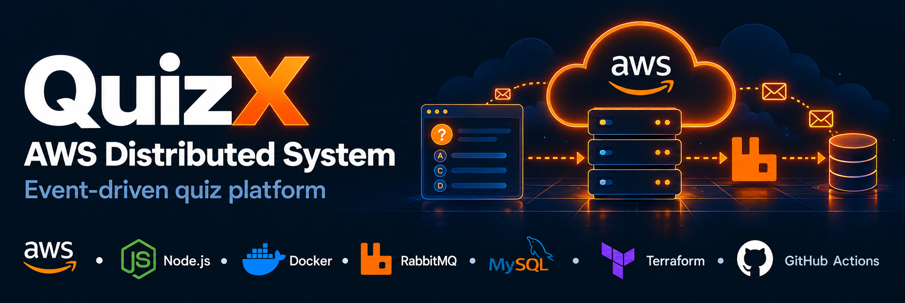
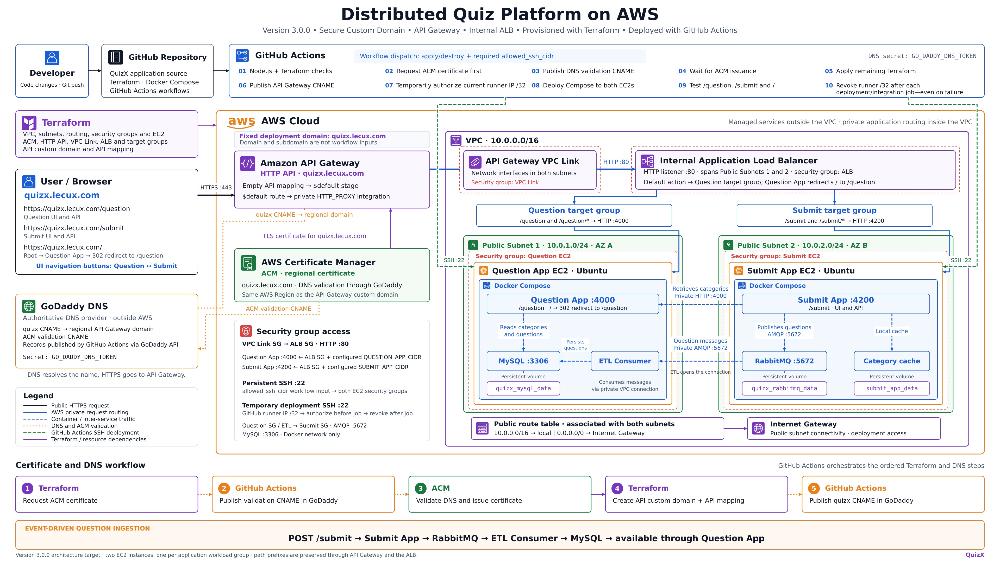

# QuizX AWS Distributed System

| Project field | Value |
|---|---|
| Version | `v3.0.0` |
| Status | Validated for release; merge and `v3.0.0` tag pending |
| Cloud provider | AWS |
| Primary URL when deployed | `https://quizx.lecux.com` |
| Deployment model | API Gateway, VPC Link, internal Application Load Balancer, two EC2 instances, Docker Compose, RabbitMQ, MySQL, Terraform, and GitHub Actions |

QuizX is a distributed multiple-choice question system. Users retrieve quiz
questions through the Question App and submit new questions through the Submit
App. Submissions travel asynchronously through RabbitMQ to an ETL consumer,
which persists them in MySQL.

Version 3 adds a single HTTPS entry point in front of the distributed runtime.
Amazon API Gateway terminates TLS with an AWS Certificate Manager certificate,
reaches an internal Application Load Balancer through a VPC Link, and routes
`/question` and `/submit` traffic to the correct EC2 workload. The deployment
workflow manages the required GoDaddy DNS records.

> The AWS infrastructure is intentionally destroyed after demonstrations to
> control cost. The public URL only resolves while the v3 stack is deployed.

## Architecture

[](docs/architecture/quizx-aws-v3-architecture.png)

Select the architecture diagram to open the full-resolution image for zooming.

```text
User
  |
  | HTTPS: quizx.lecux.com
  v
GoDaddy DNS
  |
  v
API Gateway custom domain + ACM certificate
  |
  | VPC Link
  v
Internal Application Load Balancer
  |
  |-- /question and /question/*
  |      -> Question App EC2
  |           |-- question-app :4000
  |           |-- etl-consumer
  |           `-- mysql :3306 (container network only)
  |
  `-- /submit and /submit/*
         -> Submit App EC2
              |-- submit-app :4200
              `-- rabbitmq :5672

Submit App -> RabbitMQ -> ETL Consumer -> MySQL -> Question App
```

Terraform places the two EC2 instances in separate public subnets and
Availability Zones. The ALB is internal. API Gateway reaches it through the VPC
Link, while security-group rules constrain traffic between the VPC Link, ALB,
applications, RabbitMQ, and administrator SSH access.

## Request Flow

1. GoDaddy resolves `quizx.lecux.com` to the API Gateway custom-domain target.
2. API Gateway serves HTTPS with the ACM certificate.
3. The `$default` API route forwards requests through the VPC Link.
4. The internal ALB selects the Question or Submit target group by path.
5. The Submit App publishes validated submissions to RabbitMQ.
6. The ETL consumer reads the queue over the private EC2 network and writes to
   MySQL.
7. The Question App reads the stored questions from MySQL.

## Components

| Component | Purpose |
|---|---|
| Amazon API Gateway | Public HTTP API and custom HTTPS entry point |
| AWS Certificate Manager | TLS certificate issuance and validation |
| API Gateway VPC Link | Private connection from API Gateway into the VPC |
| Internal Application Load Balancer | Health-aware path routing to both applications |
| Question App EC2 | Runs the Question App, ETL consumer, and MySQL |
| Submit App EC2 | Runs the Submit App and RabbitMQ |
| RabbitMQ | Durable question-submission queue |
| ETL consumer | Consumes submissions and persists them in MySQL |
| MySQL | Stores categories, questions, and answer options |
| GoDaddy DNS | Hosts certificate-validation and application CNAME records |
| Terraform | Defines the AWS infrastructure as code |
| GitHub Actions | Runs CI, provisions, deploys, tests, and cleans up |

## Technology Stack

| Area | Technology |
|---|---|
| Cloud | AWS |
| Public API | Amazon API Gateway HTTP API |
| Private ingress | API Gateway VPC Link and internal ALB |
| TLS | AWS Certificate Manager |
| DNS | GoDaddy Domains API |
| Compute | Amazon EC2 on Ubuntu |
| Infrastructure as code | Terraform with encrypted S3 state |
| Runtime | Docker and Docker Compose |
| Applications | Node.js and Express |
| Messaging | RabbitMQ |
| Database | MySQL |
| CI/CD | GitHub Actions |
| Deployment transport | SSH with temporary runner access rules |

## Repository Structure

```text
quizx-aws-distributed-system/
├── .github/workflows/
│   ├── cli.yml
│   ├── deploy-manual-ec2.yml
│   └── deploy.yml
├── app/
│   ├── etl-consumer/
│   │   ├── src/
│   │   └── Dockerfile
│   ├── question-app/
│   │   ├── public/
│   │   ├── src/
│   │   └── Dockerfile
│   └── submit-app/
│       ├── public/
│       ├── src/
│       └── Dockerfile
├── database/
│   ├── Dockerfile
│   └── mysql/
│       ├── schema.sql
│       └── seed.sql
├── docs/
│   ├── architecture/
│   │   ├── quizx-aws-v1-architecture.png
│   │   ├── quizx-aws-v2-architecture.png
│   │   └── quizx-aws-v3-architecture.png
│   ├── images/
│   ├── screenshots/
│   └── testing/
│       ├── v1-test-evidence.md
│       ├── v2-test-evidence.md
│       └── v3-test-evidence.md
├── infra/
│   ├── docker/
│   │   ├── docker-compose.yml
│   │   ├── docker-compose-question-app-ec2.yml
│   │   └── docker-compose-submit-app-ec2.yml
│   └── terraform/
│       ├── alb.tf
│       ├── api-gateway.tf
│       ├── backend.tf
│       ├── domain.tf
│       ├── ec2.tf
│       ├── security_group.tf
│       ├── variables.tf
│       ├── vpc.tf
│       └── outputs.tf
├── scripts/godaddy-dns.sh
├── .env.example
├── README.md
└── RELEASE_NOTES.md
```

## Application Routes

Use the prefixed routes through the v3 public custom domain.

### Question App

| Method | Public path | Purpose |
|---|---|---|
| `GET` | `/question` | Question App interface |
| `GET` | `/question/health` | Process health check |
| `GET` | `/question/ready` | MySQL readiness check |
| `GET` | `/question/categories` | List categories |
| `GET` | `/question/:category` | Return a random question |
| `GET` | `/question/:category?count=n` | Return up to `n` random questions |
| `GET` | `/question/docs` | API description |

### Submit App

| Method | Public path | Purpose |
|---|---|---|
| `GET` | `/submit` | Submit App interface |
| `GET` | `/submit/health` | Process health check |
| `GET` | `/submit/ready` | RabbitMQ readiness check |
| `GET` | `/submit/categories` | List categories from the Question App or cache |
| `POST` | `/submit` | Validate and queue a question submission |
| `GET` | `/submit/docs` | API description |

`GET /` redirects to `/question` through the default Question App ALB target.

## Ports and Exposure

| Component | Port | Exposure |
|---|---:|---|
| API Gateway HTTPS | `443` | Public custom-domain entry point |
| Internal ALB | `80` | VPC Link security group only |
| Question App | `4000` | ALB, Submit App, and configured `QUESTION_APP_CIDR` |
| Submit App | `4200` | ALB and configured `SUBMIT_APP_CIDR` |
| RabbitMQ AMQP | `5672` | Question App EC2 security group only in AWS |
| RabbitMQ management | `15672` | Mapped by Docker but not exposed by the AWS security group |
| MySQL | `3306` | Docker network only; no host port mapping |
| ETL consumer | None | Outbound client of RabbitMQ and MySQL |

The custom HTTPS URL is the normal user entry point. Direct EC2 application
ports exist for scoped testing and are controlled by deployment CIDR values.

## Design Decisions

### API Gateway and ACM

API Gateway provides one stable public hostname instead of separate application
URLs. ACM supplies the certificate used by the custom domain.

### VPC Link and Internal ALB

The VPC Link lets API Gateway reach the load balancer without making the ALB
internet-facing. The ALB provides health-aware target groups and path routing.

### Two Availability Zones

Application Load Balancers require subnets in at least two Availability Zones.
The application instances are placed in separate public subnets in
`eu-west-2a` and `eu-west-2b` by default.

### RabbitMQ and ETL

RabbitMQ decouples the Submit App from database writes. The ETL consumer can
process retained messages after it reconnects.

### Docker Compose

Docker Compose provides service-name networking, health checks, restart
policies, and persistent volumes while keeping the learning deployment clear.

## Security Model

- HTTPS is terminated by API Gateway using an ACM certificate.
- The internal ALB accepts traffic from the VPC Link security group.
- ALB egress is limited to the two application security groups and ports.
- RabbitMQ traffic between EC2 instances is authorized by security-group
  reference rather than a public CIDR.
- MySQL has no public host-port mapping.
- Persistent administrator SSH access is restricted by the required
  `allowed_ssh_cidr` workflow input.
- GitHub runner SSH access is temporary and revoked even after job failure.
- Credentials are stored in GitHub Actions secrets and are not committed.
- Terraform state is encrypted in S3 and is not committed.

This is a learning deployment. It still uses public EC2 subnets, direct SSH,
and long-lived AWS access keys. See [security notes](docs/security-notes.md).

## Prerequisites

- AWS account with permissions for the resources in `infra/terraform`
- Pre-existing S3 backend matching `infra/terraform/backend.tf`
- GoDaddy domain using GoDaddy authoritative DNS
- GoDaddy token with `domains.domain:read` and `domains.dns:update`
- EC2-compatible SSH key pair
- GitHub Actions secrets listed below
- For local use: Git, Node.js 22, Docker Compose, Terraform, AWS CLI, `curl`,
  and `jq`

## Local Configuration and Deployment

Create the environment file and replace every password placeholder:

```bash
cp .env.example .env
```

```env
MYSQL_ROOT_PASSWORD=replace_with_secure_root_password
DB_NAME=quizx
DB_USER=quizx_app
DB_PASSWORD=replace_with_secure_database_password

RABBITMQ_USER=quizx
RABBITMQ_PASSWORD=replace_with_secure_rabbitmq_password
RABBITMQ_QUEUE=question.submitted
```

Do not commit `.env`. Start the complete stack, including the profiled ETL
consumer:

```bash
docker compose --env-file .env --profile etl \
  -f infra/docker/docker-compose.yml \
  up -d --build
```

Inspect status and logs:

```bash
docker compose --env-file .env --profile etl -f infra/docker/docker-compose.yml ps
docker logs quizx-question-app
docker logs quizx-submit-app
docker logs quizx-rabbitmq
docker logs quizx-etl-consumer
docker logs quizx-mysql
```

Run local smoke tests:

```bash
curl http://localhost:4000/health
curl http://localhost:4000/categories
curl "http://localhost:4000/questions/Science?count=3"
curl http://localhost:4200/health
curl http://localhost:4200/categories
curl http://localhost:4200/docs
```

Stop without deleting persistent volumes:

```bash
docker compose --env-file .env --profile etl -f infra/docker/docker-compose.yml down
```

Add `--volumes` only when intentionally deleting local MySQL, RabbitMQ, and
category-cache data.

## Terraform

GitHub Actions is the recommended provisioning path because it coordinates ACM
validation and GoDaddy DNS. Local commands remain useful for validation:

```bash
cd infra/terraform
terraform init
terraform fmt -check
terraform validate
terraform plan
```

Important inputs include:

```hcl
project_name         = "quizx-aws"
aws_region           = "eu-west-2"
availability_zone_1  = "eu-west-2a"
availability_zone_2  = "eu-west-2b"
public_subnet_1_cidr = "10.0.1.0/24"
public_subnet_2_cidr = "10.0.2.0/24"

allowed_ssh_cidr  = "YOUR_PUBLIC_IPV4/32"
question_app_cidr = "YOUR_PUBLIC_IPV4/32"
submit_app_cidr   = "YOUR_PUBLIC_IPV4/32"

ssh_port          = 22
question_app_port = 4000
submit_app_port   = 4200

aws_ami_id     = "ami-xxxxxxxxxxxxxxxxx"
instance_type  = "t3.micro"
ec2_key_name   = "quizx-ec2-key-unique-name"
ssh_public_key = "ssh-ed25519 AAAA... your-key-comment"

enable_custom_domain = true
domain_name          = "lecux.com"
api_subdomain        = "quizx"
```

When using `deploy.yml`, the domain is fixed to `quizx.lecux.com`. Useful
outputs include:

```text
question_app_ec2_public_ip
question_app_ec2_private_ip
question_app_ssh_command
question_app_url
submit_app_ec2_public_ip
submit_app_ec2_private_ip
submit_app_ssh_command
submit_app_url
api_custom_url
api_gateway_domain_target
acm_certificate_arn
```

## GitHub Actions

### CI

`.github/workflows/cli.yml` runs on pushes to `feature/aws-v3`, pull requests,
and manual dispatch. It performs dependency installation and syntax checks for
all three Node.js services, Docker image builds, and Terraform formatting,
initialization, validation, and planning.

### Deployment

Run `.github/workflows/deploy.yml` manually with:

- `terraform_action`: `apply` or `destroy`;
- `allowed_ssh_cidr`: the administrator IPv4 CIDR, preferably one `/32`.

An apply run:

1. validates Terraform;
2. requests the ACM certificate;
3. publishes ACM validation records through the GoDaddy API;
4. waits for certificate validation;
5. applies the complete Terraform plan;
6. publishes the API Gateway CNAME;
7. grants each GitHub runner temporary SSH access;
8. deploys the two EC2 workloads in parallel;
9. runs health, ETL, private integration, and HTTPS routing checks;
10. revokes all temporary runner SSH rules.

A destroy run removes matching managed DNS records before destroying AWS
resources. The remote S3 backend remains for state history.

## Required GitHub Secrets

Configure these under **Settings → Secrets and variables → Actions**:

| Secret | Purpose |
|---|---|
| `AWS_ACCESS_KEY_ID` | AWS access key used by the workflows |
| `AWS_SECRET_ACCESS_KEY` | AWS secret key used by the workflows |
| `AWS_REGION` | Deployment region, normally `eu-west-2` |
| `AWS_AMI_ID` | Ubuntu AMI used by both EC2 instances |
| `SSH_PUBLIC_KEY` | Public key registered as the EC2 key pair |
| `EC2_SSH_PRIVATE_KEY` | Private key used for deployment |
| `QUESTION_APP_CIDR` | CIDR allowed direct access to port `4000` |
| `SUBMIT_APP_CIDR` | CIDR allowed direct access to port `4200` |
| `MYSQL_ROOT_PASSWORD` | MySQL root password |
| `DB_PASSWORD` | Password shared by MySQL and its clients |
| `RABBITMQ_PASSWORD` | Password shared by RabbitMQ publisher and consumer |
| `GO_DADDY_DNS_TOKEN` | GoDaddy token used to manage CNAME records |

`deploy.yml` uses the required `allowed_ssh_cidr` input and does not read
`ALLOWED_SSH_CIDR`. The legacy CLI and manual EC2 workflows still use that
secret when invoked. Store only the GoDaddy token value; do not include
`Bearer` or surrounding quotes.

## Public Verification

While the infrastructure is deployed:

```bash
curl -I https://quizx.lecux.com/
curl https://quizx.lecux.com/question/health
curl https://quizx.lecux.com/question/ready
curl https://quizx.lecux.com/question/categories
curl "https://quizx.lecux.com/question/Science?count=3"
curl https://quizx.lecux.com/submit/health
curl https://quizx.lecux.com/submit/ready
curl https://quizx.lecux.com/submit/categories
curl https://quizx.lecux.com/submit/docs
```

Submit a question:

```bash
curl -X POST https://quizx.lecux.com/submit \
  -H "Content-Type: application/json" \
  -d '{
    "category": "AWS",
    "newCategory": "",
    "question": "Which AWS service provides virtual servers?",
    "options": ["EC2", "S3", "RDS", "CloudFront"],
    "answer": "EC2"
  }'
```

The expected response is HTTP `202`. After ETL processes the message, retrieve
the category through the Question App to confirm persistence.

## Persistence and Resilience

For persistence, submit a unique question, recreate the Question App Compose
services without `--volumes`, and confirm the question remains in MySQL.

For durable-queue testing:

1. stop `quizx-etl-consumer`;
2. submit a unique question;
3. confirm RabbitMQ retains one ready message;
4. restart the consumer;
5. confirm the message is consumed;
6. retrieve the question through the Question App.

For service resilience, stop either application container and verify the other
EC2 workload remains running. The Submit App can return cached categories while
the Question App is temporarily unavailable.

## Verification Evidence

- [Release-candidate CI run #68](https://github.com/JacobSidhu/quizx-aws-distributed-system/actions/runs/35469189443)
- [Release-candidate apply, deployment, integration, and HTTPS run #114](https://github.com/JacobSidhu/quizx-aws-distributed-system/actions/runs/35469548247)
- [Release-candidate destroy run #115](https://github.com/JacobSidhu/quizx-aws-distributed-system/actions/runs/35470976516)
- [v1 test evidence](docs/testing/v1-test-evidence.md)
- [v2 test evidence](docs/testing/v2-test-evidence.md)
- [v3 release-candidate test evidence](docs/testing/v3-test-evidence.md)

All three release-candidate workflows tested commit
`7e2d638d2900d7bb9e390fc1209baa7fd029983b`. Local validation, live HTTPS
submission and retrieval, security verification, and AWS cleanup also passed.
Merge and tagging remain intentionally pending.

## Cleanup

Run the **Deploy** workflow with `terraform_action: destroy` and the required
administrator SSH CIDR. Domain values are fixed by `deploy.yml`, not entered as
workflow inputs.

The workflow removes the matching GoDaddy records before Terraform removes:

- API Gateway API, integration, custom domain, and mapping;
- VPC Link;
- internal ALB, listener, rules, target groups, and attachments;
- ACM certificate and validation resource;
- both EC2 instances and Terraform-managed storage;
- application, ALB, and VPC Link security groups;
- both subnets, route associations, internet gateway, and VPC.

Confirm no unexpected EC2 instances, EBS volumes, public IPv4 addresses, load
balancers, VPC Links, or other billable resources remain.

## Cost Management

Potential costs include two EC2 instances and EBS volumes, public IPv4
addresses, the ALB, API Gateway requests, S3 state storage, data
transfer, and AWS service logs. The design avoids NAT Gateway, RDS, Amazon MQ,
ECS, and ECR costs. Destroy the stack after testing and review AWS Billing.
See [cost notes](docs/cost-notes.md).

## Known Limitations and Future Improvements

- Replace long-lived AWS keys with GitHub OIDC and an IAM role.
- Replace SSH deployment with immutable image-based deployment.
- Move application instances into private subnets.
- Consider RDS and a managed messaging service.
- Store runtime credentials in Secrets Manager or Parameter Store.
- Add authentication, moderator authorization, and rate limiting.
- Add centralized logs, dashboards, alarms, and tracing.
- Add automated application tests beyond syntax and smoke checks.
- Publish images through ECR and consider ECS deployment.

## What V3 Demonstrates

- Multi-AZ VPC and subnet design
- Security-group-to-security-group access control
- API Gateway custom domains and HTTP proxy integration
- Private integration through VPC Link
- Internal ALB target groups, health checks, and path routing
- ACM validation through an external DNS provider
- Automated GoDaddy DNS record lifecycle management
- Distributed Docker workloads across two EC2 instances
- Durable RabbitMQ messaging and ETL processing
- Persistent MySQL storage
- Terraform remote state and repeatable infrastructure
- Parallel deployment and failure-safe temporary SSH access
- End-to-end HTTPS and integration verification

## Release

The release candidate passed CI, apply, deployment, integration, HTTPS, manual
end-to-end submission, and destroy checks. Merge and tagging are intentionally
on hold. When release approval is given, create the `v3.0.0` tag from the final
`main` commit:

```bash
git tag -a v3.0.0 \
  -m "Release QuizX AWS v3.0.0 API Gateway and HTTPS architecture"
git push origin v3.0.0
```

Suggested release title:

```text
QuizX AWS v3.0.0 — API Gateway, VPC Link, Internal ALB, ACM, and GoDaddy DNS
```

## Project Summary

QuizX AWS v3.0.0 is a distributed cloud-engineering project with a single
custom HTTPS endpoint. API Gateway and ACM provide the public TLS boundary, a
VPC Link connects to an internal ALB, and path routing directs traffic to two
EC2-hosted Node.js applications. RabbitMQ and an ETL consumer provide durable
asynchronous processing, while MySQL stores quiz data. Terraform, Docker
Compose, GitHub Actions, and GoDaddy DNS automation make the environment
repeatable from provisioning through cleanup.

Legacy UI prototypes: [Question App](https://www.figma.com/proto/KCH2RPRIBkATIy3ZgRKi79/QuizX?node-id=41-113&t=FFJBauryCt84Bxe9-1) and [Submit App](https://www.figma.com/proto/KCH2RPRIBkATIy3ZgRKi79/QuizX?node-id=0-1&t=1fftyZSMal3CHOug-1).
